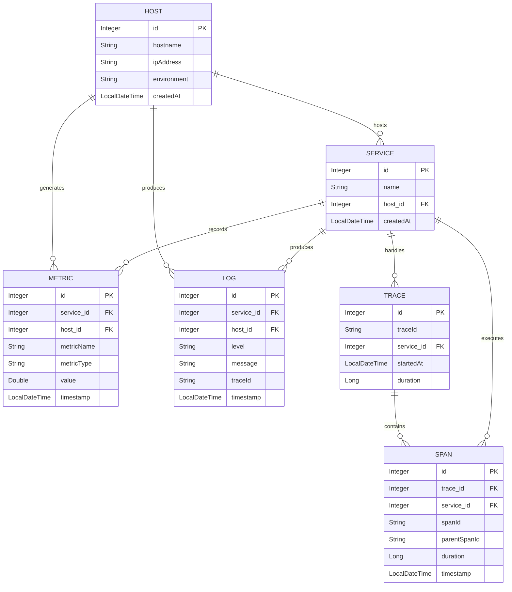

| Entity  | Description                                                                | Key Relationships                                                                |
| ------- | -------------------------------------------------------------------------- | -------------------------------------------------------------------------------- |
| HOST    | Infrastructure node that runs services and emits metrics/logs.             | HOST 1..\* SERVICE, HOST 1..\* METRIC, HOST 1..\* LOG                            |
| SERVICE | Application component deployed on a host that produces observability data. | SERVICE 1..\* METRIC, SERVICE 1..\* LOG, SERVICE 1..\* TRACE, SERVICE 1..\* SPAN |
| METRIC  | Time-series measurement captured for a service or host.                    | Belongs to one HOST and one SERVICE                                              |
| LOG     | Structured event record with level, message, and optional trace context.   | Belongs to one HOST and one SERVICE                                              |
| TRACE   | End-to-end request flow captured across services.                          | TRACE 1..\* SPAN; belongs to one SERVICE                                         |
| SPAN    | Unit of work within a trace, optionally linked to a parent span.           | Belongs to one TRACE and one SERVICE                                             |
