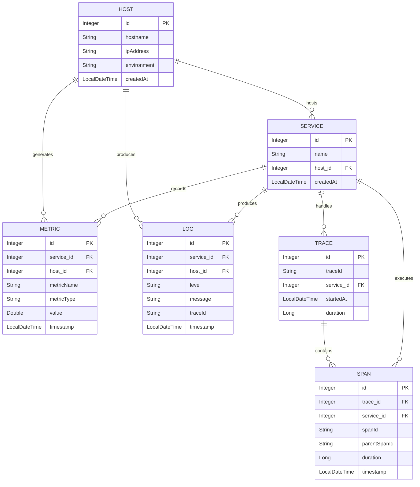

```mermaid
erDiagram

    HOST {
        Integer id PK
        String hostname
        String ipAddress
        String environment
        LocalDateTime createdAt
    }

    SERVICE {
        Integer id PK
        String name
        Integer host_id FK
        LocalDateTime createdAt
    }

    METRIC {
        Integer id PK
        Integer service_id FK
        Integer host_id FK
        String metricName
        String metricType
        Double value
        LocalDateTime timestamp
    }

    LOG {
        Integer id PK
        Integer service_id FK
        Integer host_id FK
        String level
        String message
        String traceId
        LocalDateTime timestamp
    }

    TRACE {
        Integer id PK
        String traceId
        Integer service_id FK
        LocalDateTime startedAt
        Long duration
    }

    SPAN {
        Integer id PK
        Integer trace_id FK
        Integer service_id FK
        String spanId
        String parentSpanId
        Long duration
        LocalDateTime timestamp
    }

    HOST ||--o{ SERVICE : hosts
    HOST ||--o{ METRIC : generates
    HOST ||--o{ LOG : produces

    SERVICE ||--o{ METRIC : records
    SERVICE ||--o{ LOG : produces
    SERVICE ||--o{ TRACE : handles

    TRACE ||--o{ SPAN : contains
    SERVICE ||--o{ SPAN : executes
```