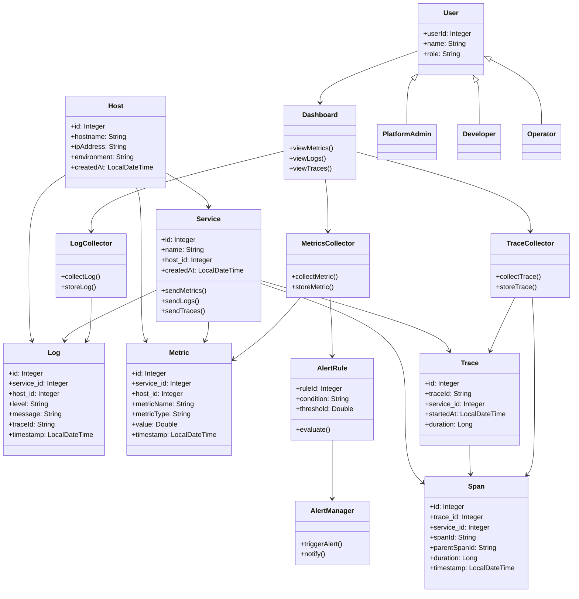

| Pattern | Where Applied | Purpose |
| --- | --- | --- |
| Observer | AlertManager -> User notifications | Decouple alert evaluation from notification delivery. |
| Strategy | AlertRule evaluation logic | Allow multiple rule types and thresholds without changing collectors. |
| Facade | Dashboard access to collectors | Provide a simplified view for metrics, logs, and traces retrieval. |

| Principle | Application |
| --- | --- |
| Encapsulation | Collectors and domain objects expose behavior through methods, hiding internal storage details. |
| Abstraction | Collectors define high-level operations like `collectMetric()` and `storeMetric()`. |
| Inheritance | Roles modeled by extending `User` (PlatformAdmin, Operator, Developer). |
| Polymorphism | Different `AlertRule` variants can evaluate conditions in their own way. |
