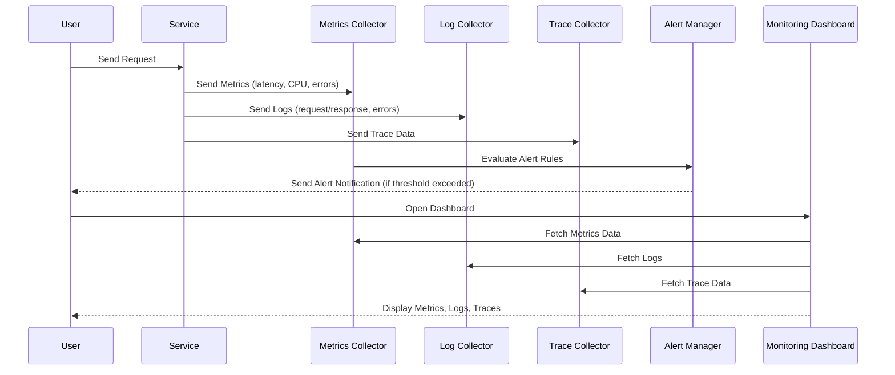

| Flow Step            | Description                                                        |
| -------------------- | ------------------------------------------------------------------ |
| User sends request   | User initiates a request to the application service.               |
| App emits telemetry  | Application sends metrics, logs, and trace data to collectors.     |
| Alert evaluation     | Metrics collector evaluates rules and triggers alerts when needed. |
| Alert notification   | Alert manager notifies the user if thresholds are exceeded.        |
| Dashboard access     | User opens the dashboard to observe system health.                 |
| Dashboard data fetch | Dashboard pulls metrics, logs, and traces from collectors.         |
| Dashboard display    | Dashboard presents combined observability data to the user.        |
