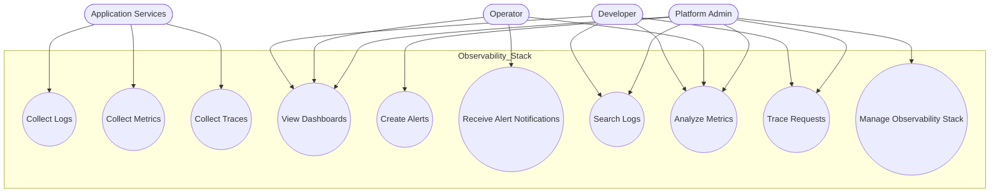

| Actor | Use Cases |
| --- | --- |
| Application Services | Collect Logs, Collect Metrics, Collect Traces |
| Developer | View Dashboards, Search Logs, Analyze Metrics, Trace Requests |
| Operator | View Dashboards, Receive Alert Notifications, Analyze Metrics |
| Platform Admin | Manage Observability Stack, Create Alerts, Access All Data |